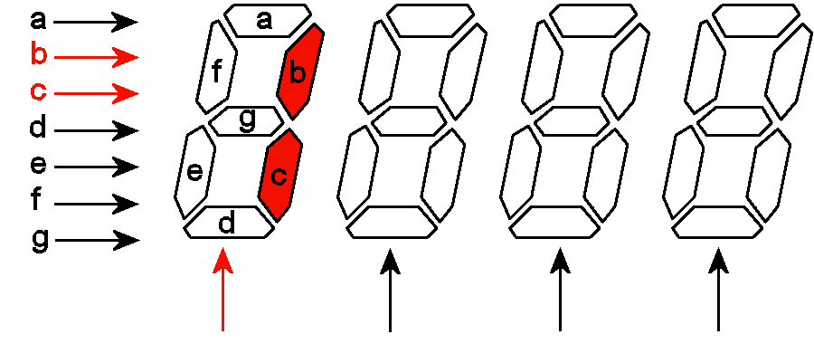

# Sistemas Digitais (HDL)

Este é um trabalho para apresentar a evolução do aprendizado a respeito de sistemas digitais mais especificamente na criação de HDL ou Hard Description Lenguage.

## Sumario 
- Portas Logicas.
- Codificadores e Decodificadores.
- Multiplexadores e Demultiplexadores
- Flip-Flops.
- Contadores e Registradores.
- Conversores A/D e D/A

## portas logicas

Quando falamos sobre portas lógicas, temos os seguintes exemplos: **AND, OR, NOT, NAND, NOR, XOR e XNOR**. Cada uma possui características específicas, com diferentes usos e aplicações. A seguir, faremos um breve resumo sobre o funcionamento e as principais utilidades de cada uma.

### Porta AND
AND
Retorna 1 (verdadeiro) apenas se todas as entradas forem 1. 
Exemplo: 1 AND 1 = 1; 1 AND 0 = 0.  
  

### Porta OR
OR
Retorna 1 se pelo menos uma das entradas for 1. 
Exemplo: 1 OR 0 = 1; 0 OR 0 = 0.  
  

### Porta NOT
NOT
Inverte o valor da entrada (porta unária). 
Exemplo: NOT 1 = 0; NOT 0 = 1.  
  

### Porta NAND
NAND (NOT AND)
É o inverso da porta AND, retornando 0 apenas se todas as entradas forem 1. 
Exemplo: 1 NAND 1 = 0; 1 NAND 0 = 1.  
  

### Porta NOR
NOR (NOT OR)
É o inverso da porta OR, retornando 1 apenas se todas as entradas forem 0. 
Exemplo: 0 NOR 0 = 1; 1 NOR 0 = 0.  
  

### Porta XOR
XOR (Exclusive OR)
Retorna 1 se apenas uma das entradas for 1 (diferentes). 
Exemplo: 1 XOR 0 = 1; 1 XOR 1 = 0.  
  

### Porta XNOR
XNOR (Exclusive NOR)
É o inverso da porta XOR, retornando 1 se as entradas forem iguais. 
Exemplo: 1 XNOR 1 = 1; 1 XNOR 0 = 0.  
  

## Codificadores e Decodificadores.

Um codificador (ou encoder) é um circuito digital combinacional que converte uma entrada ativa em um código binário correspondente. Ele possui várias linhas de entrada e algumas linhas de saída, e sua função principal é traduzir uma entrada específica em uma representação binária menor.

### encoder

Como demonstração iremos fazer um encoder do codigo grey para a base binaria.

Comecemos criando uma tabela para podermos analisar todos os dados e consequentemente tambem conferi-los. 
 

 

o proximo passo sera criar uma tabela da verdade ou mapa de karnaugh para conseguir obter o produto da soma ou a soma do produto onde os elementos binario serao A, B, C, D e os elementos do grey serão S1, S2, S3, S4.  

 

Agoro fazermos o produto da soma e simpleficamos a função do circuito obtendo o seguinte resultado:

> A = (S1*S4)+(S1*S3)+(S1*S2) 
> B = (S1*~S3*~S4)+(~S1*S2*S4)+(~S1*S2*S3)+(S1*~S2) 
> C = (~S2*S3*S4)+(S2*~S4)+(S2*~S3)+(~S1*~S2*S3) 
> D = (~S1*~S2*S4)+(S3*S4)+(S2*S3) 

no final obtemos o seguinte circuito.
 

### decoder

Para exemplificar vamos fazer um decoder de um numero binario para um hexdecimal em um display de 7 segmentos.

Para podermos fazer essa converção entendemos que precisamos fazer combinações de 4 bits de 0s e 1s que resultara na apresentação do numero no nosso display.

- **primeiro** jogamos nossos elementos (bits) na tabela verdade e obtemos os seguinte resultado.
 
 

 
 
- **segundo** fazemos a conversão para a soma dos produtos minimizada obtendo o seguinte resultado:
 
> terminal a = (~B*~D)+(A*~B*~C)+(~A*C)+(~A*B*D)+(B*C) 
> terminal b = (A*~C*D)+(~B*~D)+(~A*~C*~D)+(~A*C*D)+(~A*~B) 
> terminal c = (~C*D)+(~A*B)+(A*~B)+(~A*~C)+(~A*D) 
> terminal d = (B*~C*D)+(~B*C*D)+(B*C*~D)+(A*~C)+(~A*~B*~D) 
> terminal e = (~B*~D)+(C*~D)+(A*C)+(A*B) 
> terminal f = (~A*B*~C)+(A*~B)+(A*C)+(~A*~C*~D)+(~A*B*~D) 
> terminal g = (B*~C)+(~B*C)+(A)+(B*~D) 

 

Apos finalizarmos o circuito obtemos o seguinte resultado.
 
 