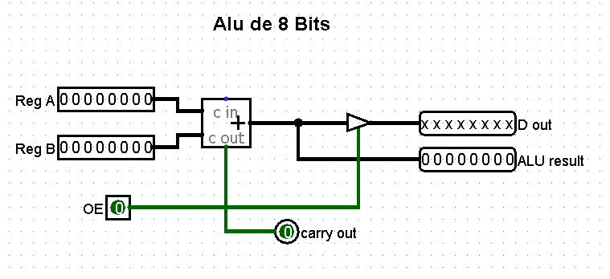
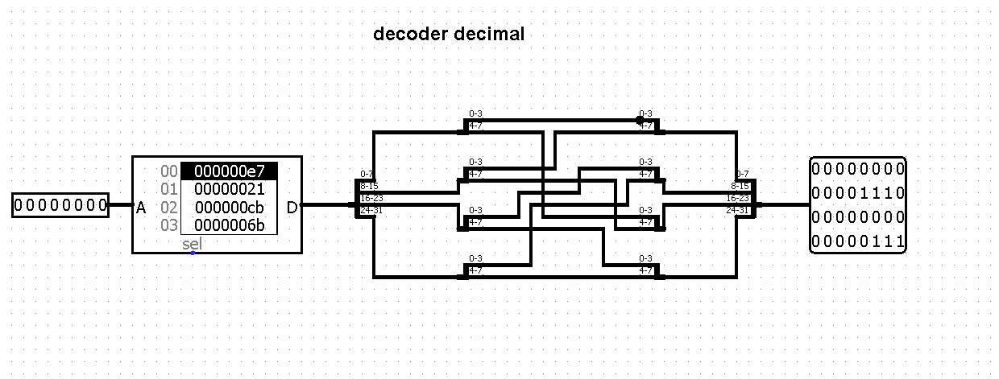

# Sistemas Digitais (VHDL)

Este é um trabalho para apresentar a evolução do aprendizado a respeito de sistemas digitais, mais especificamente na criação do SAP-1 em VHDL. Ao decorrer da leitura, você perceberá que alguns componentes se repetirão. Não se preocupe, isso é normal, já que a base de tudo são os registradores.

## Sumario 
- Arquitetura.
- Flip-Flop tipo D.
- Memory Cell.
- Register (8 Bits).
- Intruction Register (IR).
- Output Register (OR).
- Memory Address Register (MAR).
- Memory Buffer Register (MBR).
- Program Counter (PC).
- Decodificador.
- ALU.
- Insternal and External Address Bus.
- Complet Circuit.

## Arquitetura

O SAP-1 é um modelo introdutório que representa um computador de 8 bits. Ele é comumente usado para demonstrar a estudantes o funcionamento básico dos componentes e suas interações. Esses componentes são:

### Flip-Flop tipo D
O flip-flop tipo D é um componente de extrema importância para a construção de um computador, sendo responsável por armazenar dentro dele o dado de 1 bit.

### Memory Cell
A memory cell, ou célula de memória, é um componente que constitui nossa memória. Ela faz a "interação" do nosso objetivo, armazenando-o em nossos registradores.

### Register 8 Bits
A função de um registrador é armazenar um certo dado temporariamente até o término da execução de uma instrução.

### Intruction Register (IR)
Este registrador armazena a instrução atual que está sendo executada. Ele recebe a instrução da memória e a decodifica para que a unidade de controle possa executá-la.

### Output Register (OR)
Este registrador armazena os dados que serão enviados para um dispositivo de saída, como um display.

### Memory Address Register (MAR)
O MAR armazena o endereço de memória que está sendo acessado para leitura ou escrita, normalmente sendo de 4 bits.

### Memory Buffer Register (MBR)
O MBR armazena temporariamente os dados que estão sendo transferidos para ou da memória.

### Program Counter (PC)
O PC é um registrador que armazena o endereço da próxima instrução a ser executada. Ele é incrementado após cada instrução para apontar para a próxima instrução na memória.

### ALU
A ALU realiza operações aritméticas e lógicas, como adição, subtração, AND, OR, etc.

### Barramento Interno e Externo
Os barramentos são os fios azuis e verdes presentes no projeto, podendo ser de 4 bits (4 fios azuis) ou de 8 bits (8 fios azuis). Os barramentos de 4 bits são responsáveis por gerenciar o acesso aos locais na memória, enquanto os barramentos de 8 bits transmitem os dados que vão para a memória ou para os registradores.

### Decodificador
Os decodificadores são circuitos digitais essenciais que convertem informações codificadas em um formato de entrada em um conjunto de sinais de saída.

### Circuito Completo
Aqui temos o exemplo já do projeto finalizado e com a integração de todos os componentes citados anteriormente. Busquei uma forma de melhorar a visibilidade dos dados e implementei decodificadores para transformarem os números binários presentes em cada componente para números decimais.

